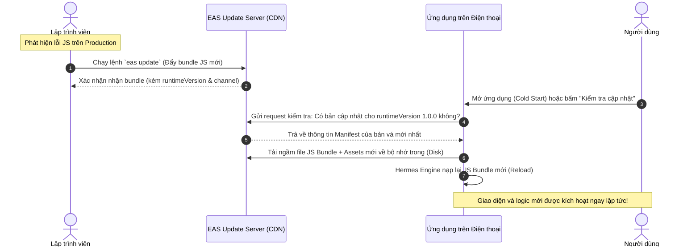

# Hướng dẫn chi tiết cơ chế và quy trình OTA Update (Over-The-Air)

Tài liệu này hướng dẫn toàn diện về cơ chế hoạt động, kiến trúc nền tảng và các bước thực hành chi tiết để phát hành bản cập nhật online (OTA Update) cho dự án **base-react-native** (Expo SDK 57, React Native 0.86, EAS Update).

---

## Mục lục

1. [Tổng quan về OTA Update](#1-tổng-quan-về-ota-update)
2. [Các khái niệm cốt lõi trong EAS Update](#2-các-khái-niệm-cốt-lõi-trong-eas-update)
   - 2.1 [EAS Update Server](#21-eas-update-server-máy-chủ-cập-nhật)
   - 2.2 [runtimeVersion (Khóa an toàn phiên bản)](#22-runtimeversion-khóa-an-toàn-phiên-bản)
   - 2.3 [Phân biệt chi tiết: Channel vs Branch](#23-phân-biệt-chi-tiết-channel-vs-branch)
   - 2.4 [So sánh câu lệnh: `--channel` vs `--branch`](#24-so-sánh-câu-lệnh---channel-vs---branch)
   - 2.5 [Chiến lược nạp bản vá (Cold Start vs Manual Trigger)](#25-chiến-lược-nạp-bản-vá-cold-start-vs-manual-trigger)
3. [Hiện trạng cấu hình trong dự án](#3-hiện-trạng-cấu-hình-trong-dự-án)
   - 3.1 [Cấu hình dự án](#31-cấu-hình-dự-án)
   - 3.2 [Mã nguồn tiện ích và giao diện](#32-mã-nguồn-tiện-ích-và-giao-diện)
   - 3.3 [Phân tích: Vì sao Updates.isEnabled = false trên Expo Go?](#33-phân-tích-vì-sao-updatesisenabled--false-trên-expo-go)
   - 3.4 [Cách trải nghiệm OTA thông qua Expo Go](#34-cách-trải-nghiệm-ota-thông-qua-expo-go)
4. [Yêu cầu môi trường và chi phí dịch vụ](#4-yêu-cầu-môi-trường-và-chi-phí-dịch-vụ)
   - 4.1 [Chi phí dịch vụ](#41-chi-phí-dịch-vụ)
   - 4.2 [Thiết lập công cụ & Xử lý lệnh `eas`](#42-thiết-lập-công-cụ--xử-lý-lệnh-eas)
5. [Quy trình thực chiến: Kiểm thử OTA trên Android](#5-quy-trình-thực-chiến-kiểm-thử-ota-trên-android)
   - 5.1 [Bước 0: Tạo bản cài đặt APK gốc (Base Build)](#51-bước-0-tạo-bản-cài-đặt-apk-gốc-base-build)
   - 5.2 [Bước 1: Sửa đổi mã nguồn (Fix bug)](#52-bước-1-sửa-đổi-mã-nguồn-fix-bug--giả-lập-bản-vá)
   - 5.3 [Bước 2: Kiểm tra tính hợp lệ](#53-bước-2-kiểm-tra-tính-hợp-lệ-của-mã-nguồn)
   - 5.4 [Bước 3: Xuất bản bản vá OTA](#54-bước-3-xuất-bản-bản-vá-ota-lên-eas-update-server)
   - 5.5 [Bước 4: Kiểm chứng trên điện thoại](#55-bước-4-kiểm-chứng-kết-quả-trên-điện-thoại-android)
   - 5.6 [Quy trình xuất bản build APK mới khi có thay đổi Native/Cấu hình](#56-quy-trình-xuất-bản-build-apk-mới-khi-có-thay-đổi-native-hoặc-cấu-hình)
6. [Quy trình kiểm thử trên nền tảng iOS](#6-quy-trình-kiểm-thử-trên-nền-tảng-ios)
7. [Rollback và quản lý bản vá khẩn cấp](#7-rollback-và-quản-lý-bản-vá-khẩn-cấp)
8. [Chính sách App Store & Google Play](#8-chính-sách-app-store--google-play)
9. [Xử lý sự cố thường gặp (Troubleshooting)](#9-xử-lý-sự-cố-thường-gặp-troubleshooting)
10. [Phụ lục: Bảng tra cứu lệnh nhanh](#10-phụ-lục-bảng-tra-cứu-lệnh-nhanh)

---

## 1. Tổng quan về OTA Update

### 1.1 OTA Update là gì?

**OTA (Over-The-Air) Update** là phương thức phát hành bản cập nhật ứng dụng trực tiếp tới thiết bị người dùng qua mạng Internet mà **không cần thông qua quy trình xét duyệt và tải lại từ App Store hay Google Play Store**.

Phương thức này đặc biệt hữu dụng khi:
- Sửa lỗi khẩn cấp (hotfix) ngoài môi trường Production (ví dụ: lỗi crash khi thanh toán, sai logic hiển thị, lỗi API).
- Cập nhật giao diện, banner, nội dung text ngôn ngữ i18n, chương trình khuyến mãi.
- Rút ngắn thời gian phát hành từ vài ngày (chờ Apple/Google duyệt) xuống còn **1–2 phút**.

### 1.2 Cấu trúc ứng dụng React Native và phạm vi OTA

Một ứng dụng React Native đã biên dịch gồm hai tầng độc lập:

```
┌────────────────────────────────────────────────────────────────────────┐
│                        Ứng dụng Mobile Hoàn Chỉnh                      │
│                                                                        │
│  ┌───────────────────────────────┐   ┌──────────────────────────────┐  │
│  │      Tầng Native Binary       │   │    Tầng JavaScript Bundle    │  │
│  │ (Java/Kotlin, Obj-C/Swift,    │◄──┤ (React, MobX, TypeScript,    │  │
│  │  Hermes Engine, Native SDK)   │   │  Styles, Assets ảnh/icon)    │  │
│  └───────────────────────────────┘   └──────────────────────────────┘  │
│                 ▲                                   ▲                  │
└─────────────────┼───────────────────────────────────┼──────────────────┘
                  │                                   │
         KHÔNG THỂ cập nhật OTA                CÓ THỂ CẬP NHẬT OTA
     (Phải nộp file mới lên Store)         (Tải ngầm từ EAS CDN về máy)
```

| Được phép cập nhật qua OTA ✅ | BẮT BUỘC phải build lại Binary và nộp Store ❌ |
|---|---|
| Mã nguồn JavaScript, TypeScript (`.js`, `.ts`, `.tsx`) | Thêm/xóa/nâng cấp thư viện Native (Camera, Bluetooth, In-App Purchase,...) |
| Giao diện, styling, CSS, màu sắc, font chữ | Sửa cấu hình Native (`AndroidManifest.xml`, `Info.plist`, quyền thiết bị) |
| File ngôn ngữ i18n (`vi.ts`, `en.ts`), text hiển thị | Thay đổi App Icon hoặc Native Splash Screen hệ điều hành |
| File tài nguyên tĩnh nội bộ (hình ảnh, icons, JSON) | Nâng cấp phiên bản React Native core hoặc Hermes Engine |
| Logic nghiệp vụ, sửa hàm tính toán, gọi API | Sửa đổi mã nguồn trong thư mục `android/` hoặc `ios/` |

> [!WARNING]
> **Quy tắc vàng:** Không bao giờ dùng `eas update` khi vừa sửa cấu hình Native (như `expo prebuild`, sửa Podfile/Gradle, đổi `ExpoReactHostFactory`). OTA chỉ mang được code JavaScript; nếu đẩy code JS gọi native module chưa có ở binary trong máy người dùng, app sẽ crash ngay lập tức!

### 1.3 Cơ chế hoạt động ngầm (How it works under the hood)



---

## 2. Các khái niệm cốt lõi trong EAS Update

### 2.1 EAS Update Server (Máy chủ cập nhật)

EAS Update Server là hệ thống máy chủ biên (CDN) phân tán toàn cầu của Expo. 
- Khi bạn chạy lệnh `eas update`, mã nguồn JS của bạn sẽ được Metro bundler đóng gói lại và tải lên hệ thống này.
- Mỗi dự án Expo được cấp một URL định danh duy nhất (trong `app.json` của dự án là `https://u.expo.dev/f6a397db-d5b1-41be-9dfd-4cf1e6a998f2`). Ứng dụng trên điện thoại sẽ truy vấn đến endpoint này để kiểm tra bản vá.

### 2.2 runtimeVersion (Khóa an toàn phiên bản)

`runtimeVersion` là **mã định danh tương thích giữa Native Shell và JS Bundle**:
- Nếu JS Bundle mới gọi một hàm native chưa từng tồn tại trong Native Shell đang cài trên máy người dùng, ứng dụng sẽ crash ngay lập tức.
- Vì vậy, `expo-updates` quy định: **Thiết bị chỉ tải và áp dụng bản cập nhật OTA khi bản cập nhật đó có `runtimeVersion` khớp chính xác với `runtimeVersion` của bản build đang chạy**.
- Trong dự án này, `runtimeVersion` được gán cố định là `"1.0.0"`.

### 2.3 Phân biệt chi tiết: Channel vs Branch (Ví von trực quan)

Để dễ hình dung nhất bản chất kỹ thuật, hãy liên tưởng đến mô hình **Kho hàng** và **Kênh phát sóng truyền hình**:

* **Branch (Nhánh) = Kho chứa hàng / Băng đĩa ghi hình:** Là nơi lưu trữ code. Bạn có thể tạo nhiều kho: `test-preview`, `hotfix-login`, `staging`... Mỗi kho lưu một phiên bản code riêng biệt.
* **Channel (Kênh) = Kênh phát sóng (Kênh Preview, Kênh Production):** Là tần số sóng mà ứng dụng trên điện thoại đang bắt tín hiệu. Bản thân Channel không chứa code, nó chỉ là một **chiếc kim chỉ đường (Pointer)** chỉ vào xem hôm nay sẽ phát sóng nội dung từ Kho (Branch) nào.
* **Chiếc điện thoại (App APK) = Chiếc TV của khán giả:** Được cài sẵn để luôn bật Kênh (Channel) `preview`.

```
                     ┌──────────────────┐
                     │   MÃ NGUỒN MỚI   │
                     └─────────┬────────┘
                               │
            ┌──────────────────┴──────────────────┐
            ▼                                     ▼
Lệnh: `update --branch test-preview`     Lệnh: `update --channel preview`
(Chỉ định cất vào KHO nào)               (Chỉ định phát lên KÊNH nào cho khán giả)
            │                                     │
            ▼                                     ▼
   [Kho: test-preview] ◄────────────── [Kênh: preview]
            │                                     │
            ▼                                     ▼
(Ai vào Kho bằng Expo Go sẽ thấy)         (Mọi chiếc TV/App APK đang bật 
                                           Kênh preview sẽ thấy ngay)
```

---

### 2.4 So sánh chuyên sâu: `--channel` vs `--branch`

#### A. Phân tích chi tiết từng câu lệnh:

1. **Lệnh `update --branch <tên-branch>` (Góc nhìn của Developer / Kho hàng):**
   - **Ý nghĩa:** Bạn ra lệnh cho EAS: *"Hãy đóng gói code này và cất vào **Kho (Branch) mang tên `test-preview`** cho tôi"*.
   - **Ai sẽ nhận được?**
     - Những ai mở app **Expo Go** (vào mục Projects chọn đúng kho `test-preview`).
     - Bất kỳ Channel nào **đang được liên kết trỏ vào kho này** (ví dụ Channel `preview` đang trỏ vào `test-preview` thì app APK cũng sẽ nhận được luôn).
2. **Lệnh `update --channel <tên-channel>` (Góc nhìn của Vận hành / Kênh phát sóng):**
   - **Ý nghĩa:** Bạn ra lệnh cho EAS: *"Tôi muốn **tất cả người dùng đang cài app ở Kênh `preview`** phải nhận được bản cập nhật này ngay lập tức!"*.
   - **EAS sẽ làm gì?** Bạn không cần nhớ Channel `preview` đang nối vào branch nào. EAS sẽ tự động tra cứu: *"Kênh preview đang trỏ vào Kho `test-preview`, vậy tôi sẽ nạp code mới vào Kho `test-preview` để phát cho app APK"*.

#### B. Bảng so sánh trực diện:

| Tiêu chí | `npx eas-cli update --branch test-preview` | `npx eas-cli update --channel preview` |
|---|---|---|
| **Bạn đang chọn gì?** | Chọn đích danh **Nơi lưu trữ code (Branch)**. | Chọn đích danh **Đối tượng người dùng nhận code (Channel)**. |
| **Góc độ sử dụng** | **Dành cho DEV / TESTER:** Muốn tạo nhiều nhánh thử nghiệm (`branch-a`, `branch-b`) để mở bằng Expo Go xem trước mà chưa muốn người dùng cài APK bị ảnh hưởng. | **Dành cho RELEASE / VẬN HÀNH:** Muốn bắn bản vá sửa lỗi thẳng tới tay người dùng đang cài app. |
| **Expo Go có xem được không?** | **Xem được** (vì Expo Go mở theo tên Branch). | **Xem được** (vì EAS cũng sẽ đẩy vào Branch mà Channel đó đang trỏ tới). |
| **Máy cài APK có nhận được không?** | **CÓ NHẬN ĐƯỢC** (nếu Channel của APK đang trỏ vào branch `test-preview`). | **CHẮC CHẮN NHẬN ĐƯỢC 100%**. |
| **Tiền tố `eas` vs `npx eas-cli`** | Giống nhau, gọi cùng một công cụ. Dùng `npx eas-cli` an toàn hơn vì không phụ thuộc vào việc máy tính đã cài đặt biến môi trường toàn cục hay chưa. |

#### C. Áp dụng vào thực tế dự án của bạn:
Hiện tại Channel `preview` của bạn đang trỏ vào Branch `test-preview`. Do đó:
- Bạn chạy `update --branch test-preview`
- Hay bạn chạy `update --channel preview`
👉 **Kết quả cuối cùng đều là 1**: Code đều được đẩy vào branch `test-preview`, và chiếc điện thoại cài APK của bạn đều sẽ nhận được bản cập nhật như nhau! (Sự khác biệt chỉ xảy ra khi bạn tạo nhiều branch độc lập khác nhau mà chưa muốn phát sóng cho Channel).

### 2.5 Chiến lược nạp bản vá (Cold Start vs Manual Trigger)

1. **Cold Start (Tự động):**
   - Mặc định, khi mở app lên lần 1, app ưu tiên nạp bản cũ từ cache để người dùng không phải đợi, đồng thời tải ngầm bản mới về máy. Đến lần mở thứ 2 bản mới mới được kích hoạt.
   - **Tối ưu với `fallbackToCacheTimeout: 5000`:** Dự án đã cấu hình Splash Screen đợi tối đa **5 giây (5000ms)** khi khởi động: Nếu mạng tải kịp bản vá mới trong 5s này, **bản mới sẽ được nạp ngay lập tức ở Lần mở đầu tiên** mà không cần người dùng phải thoát ra mở lại! Nếu quá 5s hoặc mất mạng, app mới mở bản cũ trong máy.
2. **Manual Trigger (Chủ động):** Lập trình viên gọi hàm `Updates.checkForUpdateAsync()` và `Updates.fetchUpdateAsync()`, sau đó gọi `Updates.reloadAsync()` để làm mới ứng dụng ngay tại thời điểm người dùng đang sử dụng (Dự án đã tích hợp sẵn luồng này tại màn hình Settings).

---

## 3. Hiện trạng cấu hình trong dự án

Mã nguồn `base-react-native` hiện tại đã được cấu hình sẵn toàn bộ nền tảng cho OTA Update:

### 3.1 Cấu hình dự án

* **`package.json`**: Đã cài đặt `"expo-updates": "~57.0.23"`.
* **`app.json`**:
  ```json
  {
    "runtimeVersion": "1.0.0",
    "owner": "qlpersy32s-team",
    "extra": {
      "eas": {
        "projectId": "f6a397db-d5b1-41be-9dfd-4cf1e6a998f2"
      }
    },
    "updates": {
      "url": "https://u.expo.dev/f6a397db-d5b1-41be-9dfd-4cf1e6a998f2",
      "fallbackToCacheTimeout": 5000
    }
  }
  ```
* **`eas.json`**: Đã gắn sẵn channel tương ứng cho từng môi trường:
  - `production` ➔ channel: `"production"`
  - `preview` / `preview:device` ➔ channel: `"preview"` / `"preview-device"`

### 3.2 Mã nguồn tiện ích và giao diện

Dự án đã triển khai sẵn toàn bộ logic kiểm tra và áp dụng bản cập nhật:
* **`app/utils/appUpdates.ts`**:
  - `checkForUpdate()`: Kiểm tra máy chủ EAS Update, tự động xử lý ngoại lệ an toàn khi chạy trong môi trường Dev Client / Expo Go.
  - `downloadAndApplyUpdate()`: Tải bản vá mới và khởi động lại ứng dụng lập tức bằng `Updates.reloadAsync()`.
* **`app/screens/Settings/SettingsScreen.tsx`**:
  - Đã tích hợp mục **"Cập nhật" (Update Section)** gồm trạng thái kiểm tra và nút bấm cập nhật trực quan cho người dùng.

### 3.3 Phân tích: Vì sao Updates.isEnabled = false trên Expo Go?

Nhiều lập trình viên thắc mắc: *`Updates.isEnabled = false` trên Expo Go là do code mình chặn hay do bản chất Expo Go?*

👉 **Đây là BẢN CHẤT CỦA EXPO GO và thiết kế mặc định của `expo-updates`:**
1. Khi chạy bằng Expo Go hoặc qua lệnh `npx expo start`, ứng dụng hoạt động ở chế độ phát triển (`__DEV__ = true`). Máy tính kết nối trực tiếp với điện thoại qua Metro Bundler để phục vụ tính năng **Fast Refresh** (sửa code máy tính ➔ app trên điện thoại nhảy cập nhật tức thì).
2. Để tránh xung đột (vừa nhận code từ Metro máy tính, vừa gọi Internet tải bundle từ EAS đè lên), tầng Native của `expo-updates` **tự động vô hiệu hóa (`isEnabled = false`)**.
3. Nếu cố tình gọi hàm `Updates.checkForUpdateAsync()` trong Expo Go, hệ thống sẽ ném ra lỗi ngoại lệ `ERR_NOT_AVAILABLE_IN_DEV_CLIENT`. Code tại `appUpdates.ts` đã chủ động bọc lại để hiển thị trạng thái `disabled` thay vì crash app.

### 3.4 Cách trải nghiệm OTA thông qua Expo Go

Mặc dù không bấm được nút "Cập nhật" trong màn Settings khi chạy Expo Go, **bạn hoàn toàn có thể trải nghiệm tải bản vá từ xa thông qua vỏ bọc của Expo Go**:

1. **Bước 1: Tắt hoàn toàn Metro trên máy tính** (không cần chạy `expo start`).
2. **Bước 2: Đẩy bản vá lên một branch:**
   ```powershell
   npx eas-cli update --branch test-preview --message "Ban giao dien V1"
   ```
3. **Bước 3: Mở bằng Expo Go trên điện thoại:**
   - Mở app Expo Go, đăng nhập tài khoản Expo của bạn.
   - Vào tab **Projects**, chọn dự án `BaseApp` và bấm vào branch `test-preview`. Expo Go sẽ tải toàn bộ bundle từ server về điện thoại và hiển thị.
4. **Bước 4: Sửa code và đẩy bản vá V2:**
   - Sửa text hoặc màu sắc trên máy tính.
   - Chạy lệnh đẩy tiếp:
     ```powershell
     npx eas-cli update --branch test-preview --message "Ban giao dien V2"
     ```
5. **Bước 5: Xem cập nhật trên điện thoại:**
   - Vuốt 3 ngón tay trên màn hình điện thoại để mở menu của Expo Go và nhấn **Reload** (hoặc tắt app Expo Go rồi mở lại). Toàn bộ giao diện mới sẽ lập tức xuất hiện!

---

## 4. Yêu cầu môi trường và chi phí dịch vụ

### 4.1 Chi phí dịch vụ

| Hạng mục | Chi phí | Ghi chú |
|---|---|---|
| **EAS Build (Đám mây Expo)** | **0 VNĐ (Gói Free)** | 30 lượt build/tháng cho cả iOS và Android gộp lại. |
| **EAS Update (Băng thông OTA)** | **0 VNĐ (Gói Free)** | Miễn phí cho 1.000 người dùng hoạt động/tháng (1,000 MAU). |
| **Tài khoản Apple Developer** | **$99 / năm** | **Chỉ áp dụng cho iOS** nếu muốn phân phối Ad Hoc hoặc TestFlight. Android hoàn toàn không mất phí. |

### 4.2 Thiết lập công cụ & Xử lý lệnh `eas`

Nếu gõ lệnh `eas ...` và gặp thông báo lỗi:
```text
eas : The term 'eas' is not recognized as the name of a cmdlet...
```
Nguyên nhân là do máy tính chưa cài đặt `eas-cli` toàn cục. Có 2 cách xử lý:

* **Cách 1: Dùng trực tiếp với tiền tố `npx` (Khuyên dùng - Nhanh nhất):**
  Thêm `npx eas-cli` trước mọi câu lệnh:
  ```powershell
  npx eas-cli build --platform android --profile preview
  npx eas-cli update --channel preview --message "Hotfix"
  ```
* **Cách 2: Cài đặt toàn cục vào hệ điều hành:**
  ```powershell
  npm install -g eas-cli
  ```
  *(Sau khi cài xong, **tắt PowerShell và mở lại cửa sổ mới** để hệ điều hành nhận diện từ khóa `eas`)*.

Đăng nhập tài khoản Expo trước khi chạy các lệnh:
```powershell
npx eas-cli login
```

---

## 5. Quy trình thực chiến: Kiểm thử OTA trên Android

Dưới đây là kịch bản chuẩn từ lúc đóng gói ứng dụng ban đầu tới khi đẩy bản sửa lỗi online tới điện thoại Android.

### 5.1 Bước 0: Tạo bản cài đặt APK gốc (Base Build)

> [!NOTE]
> Bước này chỉ thực hiện 1 lần duy nhất để cài bản app ban đầu (Bản V1) lên thiết bị.

#### A. Lệnh build ứng dụng
Chạy lệnh build file APK preview trên đám mây của Expo:
```powershell
npx eas-cli build --platform android --profile preview
```
*(Trên Windows, lệnh này không đòi hỏi cài Android SDK hay JDK trên máy, máy chủ Expo sẽ tự đóng gói).*

#### B. Cơ chế tự động của lệnh Build đối với Channel và Branch
Khi bạn chạy lệnh trên lần đầu tiên:
1. EAS đọc file `eas.json` và thấy profile `preview` có cấu hình `"channel": "preview"`.
2. EAS kiểm tra trên dự án: Nếu Channel `preview` **chưa tồn tại**, EAS sẽ **tự động tạo Channel `preview`**.
3. **Quy tắc bắt buộc:** Vì một Channel bắt buộc phải trỏ vào một Branch, nên EAS sẽ:
   - **Tự động tạo luôn một Branch mới có cùng tên (`preview`)**.
   - Thiết lập liên kết: **Channel `preview` ➔ Branch `preview`**.
4. Bản APK xuất ra sẽ được gắn cứng việc lắng nghe Channel `preview`.

#### C. Cách tự thiết lập Channel và trỏ vào Branch có sẵn (Tránh sinh branch mới)
Nếu bạn đã có sẵn một branch (ví dụ: `test-preview` từng dùng để test trên Expo Go) và muốn bản build nghe channel `preview` nhưng **trỏ thẳng vào `test-preview`** chứ không sinh thêm branch `preview`:

* **Cách 1: Tạo trước Channel trước khi chạy Build (Chủ động hoàn toàn):**
  Trước khi gõ lệnh build, bạn chạy lệnh tạo channel này trước:
  ```powershell
  npx eas-cli channel:create preview --branch test-preview
  ```
  Sau đó mới chạy lệnh build:
  ```powershell
  npx eas-cli build --platform android --profile preview
  ```
  *(Lúc này EAS thấy Channel `preview` đã có sẵn và đang trỏ vào `test-preview`, nó sẽ dùng luôn cấu hình này mà **không bao giờ sinh thêm branch `preview` nữa**).*

* **Cách 2: Đổi hướng Channel sau khi đã lỡ Build (Không cần build lại APK):**
  Nếu bạn đã lỡ chạy lệnh build và EAS đã tự sinh ra branch `preview`, bạn có thể đổi Channel `preview` trỏ sang `test-preview` bất cứ lúc nào:
  - **Bằng dòng lệnh:**
    ```powershell
    npx eas-cli channel:edit preview --branch test-preview
    ```
  - **Bằng giao diện Web `expo.dev`:**
    1. Đăng nhập [expo.dev](https://expo.dev) ➔ Chọn dự án ➔ Vào mục **Channels**.
    2. Bấm vào Channel `preview` (hoặc biểu tượng 3 chấm `...` / Edit).
    3. Tại mục **Point to branch**, chọn chuyển sang **`test-preview`** ➔ Nhấn **Save**.
    *(Ngay lập tức, mọi máy cài APK preview sẽ tự động nạp code từ branch `test-preview` mà không cần build lại file APK).*

#### D. Cài đặt và kiểm tra bản V1
1. Khi tiến trình build hoàn tất, terminal sẽ hiển thị **đường dẫn tải file `.apk`** (hoặc quét mã QR trên màn hình).
2. Tải file `.apk` về điện thoại Android và tiến hành cài đặt.
3. Mở ứng dụng lên để xác nhận ứng dụng chạy bình thường (Giao diện ban đầu - Bản V1).

### 5.2 Bước 1: Sửa đổi mã nguồn (Fix bug / Giả lập bản vá)

Mở mã nguồn dự án trên máy tính, thực hiện một thay đổi nhỏ trên giao diện:
- Mở file `app/screens/Home/HomeScreen.tsx` (hoặc `app/i18n/vi.ts`).
- Đổi một chuỗi văn bản hoặc thêm một dòng thông báo, ví dụ:
  ```tsx
  <Text text="ĐÃ CẬP NHẬT OTA THÀNH CÔNG!" preset="heading" />
  ```
- **Lưu ý:** Chỉ sửa các file JavaScript/TypeScript/Styles/Assets. **Không thêm thư viện Native mới**.

### 5.3 Bước 2: Kiểm tra tính hợp lệ của mã nguồn

Đảm bảo mã nguồn không phát sinh lỗi cú pháp trước khi đóng gói:

```powershell
pnpm run compile       # Kiểm tra TypeScript
pnpm test              # Chạy Unit Tests
```

### 5.4 Bước 3: Xuất bản bản vá OTA lên EAS Update Server

Chạy lệnh phát hành bản cập nhật cho kênh `preview`:

```powershell
npx eas-cli update --channel preview --message "Hotfix cap nhat giao dien Home"
```

**Quá trình diễn ra phía sau:**
1. Metro bundler biên dịch toàn bộ code TypeScript/React thành file JavaScript bytecode tối ưu cho Hermes.
2. Nén toàn bộ assets và JS bundle tải lên URL `https://u.expo.dev/...`.
3. Đăng ký bản cập nhật vào kênh `preview` với `runtimeVersion: "1.0.0"`.

### 5.5 Bước 4: Kiểm chứng kết quả trên điện thoại Android

Cầm chiếc điện thoại Android đã cài đặt Bản V1 ở Bước 0:

* **Cách 1: Thao tác chủ động qua giao diện**
  1. Mở ứng dụng, vào màn hình **Settings** (biểu tượng bánh răng ở góc trên).
  2. Tại mục **Cập nhật**, nhấn nút **"Kiểm tra cập nhật"**.
  3. Ứng dụng sẽ kiểm tra máy chủ EAS, báo trạng thái phát hiện bản vá mới và hiển thị nút **"Cập nhật ngay"**.
  4. Nhấn **"Cập nhật ngay"**, ứng dụng tự khởi động lại và dòng chữ `"ĐÃ CẬP NHẬT OTA THÀNH CÔNG!"` sẽ xuất hiện ngay lập tức!
* **Cách 2: Cập nhật tự động khi khởi động (Cold Start)**
  - **Với bản build đã có `fallbackToCacheTimeout: 5000`:** Bạn chỉ cần vuốt tắt hẳn app (kill app) và mở lại **ĐÚNG 1 LẦN DUY NHẤT**. Màn hình Splash sẽ dừng chờ 1–2 giây để tải bản vá và giao diện mới sẽ xuất hiện ngay lập tức!
  - **Với bản build cũ (`0ms`):** Mở lần 1 để app tải ngầm bản vá về bộ nhớ, sau đó tắt app mở lại lần 2 để kích hoạt.

### 5.6 Quy trình xuất bản build APK mới (Khi có thay đổi Native hoặc cấu hình)

Khi bạn có những thay đổi liên quan đến tầng Native (như vừa cấu hình `fallbackToCacheTimeout: 5000` trong `app.json` và `AndroidManifest.xml`, hoặc cài thêm thư viện Native mới), bản cập nhật OTA không thể mang theo những thay đổi này. Bạn cần **xuất bản một bản build APK mới**:

#### Bước 1: Commit các thay đổi mã nguồn
Commit toàn bộ thay đổi cấu hình vào Git để EAS đóng gói đúng phiên bản mới nhất:
```powershell
git add .
git commit -m "Cau hinh fallbackToCacheTimeout 5s cho OTA update"
```

#### Bước 2: Chạy lệnh đóng gói trên EAS Cloud
Chạy lệnh biên dịch cho nền tảng Android với profile `preview`:
```powershell
npx eas-cli build --platform android --profile preview
```

**Tiến trình diễn ra:**
1. Mã nguồn được nén và đẩy lên máy chủ đám mây của Expo.
2. EAS tự động biên dịch, gắn các cấu hình native (`EXPO_UPDATES_LAUNCH_WAIT_MS = 5000`, icon, permissions...) vào file APK.
3. Khi hoàn tất (khoảng 5–10 phút), terminal sẽ cung cấp **đường dẫn tải file `.apk`** kèm **mã QR**.

#### Bước 3: Cài đặt bản APK mới lên điện thoại
1. Dùng điện thoại quét mã QR hoặc mở link tải file `.apk` mới về máy.
2. Tiến hành cài đặt (bản mới sẽ cài đè lên bản cũ).

#### Bước 4: Kiểm chứng lợi ích của bản build mới
Từ bản build này trở đi:
- Mỗi khi bạn sửa code JS và chạy `npx eas-cli update --channel preview --message "..."`.
- Bạn không cần bấm nút trong Settings và cũng **không cần thoát mở app 2 lần** nữa: Chỉ cần kill app và mở lại 1 lần, màn hình Splash Screen sẽ tự động dừng chờ 1–2 giây để tải bản mới và đưa bạn vào giao diện đã fix bug ngay lập tức!

---

## 6. Quy trình kiểm thử trên nền tảng iOS

Khác với sự linh hoạt của Android, Apple yêu cầu chữ ký số (Code Signing) cho mọi file cài đặt.

### 6.1 Tổng hợp các phương thức kiểm thử trên iOS

| Phương thức | Chi phí | Thiết bị | Khả năng kiểm thử OTA |
|---|:---:|---|:---:|
| **iOS Simulator** | Miễn phí | Máy Mac (chạy giả lập Xcode) | Đầy đủ như máy thật |
| **iPhone thật qua Ad Hoc** | Cần Apple Dev ($99) | iPhone thật (quét QR cài đặt) | Đầy đủ |
| **iPhone thật qua TestFlight** | Cần Apple Dev ($99) | iPhone thật (cài qua app TestFlight) | Đầy đủ chuẩn Production |
| **Apple ID cá nhân (Sideload)** | Miễn phí | iPhone thật (ký qua AltStore/Sideloadly) | Đầy đủ (hạn sử dụng 7 ngày) |

### 6.2 Kiểm thử trên iOS Simulator (Dành cho máy Mac)

1. Build gói cài đặt cho simulator:
   ```bash
   npx eas-cli build --platform ios --profile preview
   ```
   *(Trong `eas.json`, profile `preview` của iOS đã cấu hình `"simulator": true`)*.
2. Tải file `.tar.gz` về máy Mac, giải nén và kéo thả file `.app` vào màn hình iOS Simulator.
3. Chạy `npx eas-cli update --channel preview` để test OTA tương tự như Android.

### 6.3 Kiểm thử trên iPhone thật (TestFlight / Ad Hoc)

1. **Với kênh Ad Hoc (Cài trực tiếp qua mã QR):**
   - Đăng ký UDID thiết bị bằng lệnh: `npx eas-cli device:create`.
   - Build file cài đặt cho thiết bị thật:
     ```bash
     npx eas-cli build --platform ios --profile preview:device
     ```
   - Dùng camera iPhone quét mã QR do EAS trả về để cài đặt.
   - Phát hành bản vá OTA:
     ```bash
     npx eas-cli update --channel preview-device --message "Hotfix cho iOS"
     ```
2. **Với kênh TestFlight:**
   - Build với profile `production` và upload lên Apple App Store Connect:
     ```bash
     npx eas-cli build --platform ios --profile production --auto-submit
     ```
   - Người dùng cài app qua TestFlight.
   - Khi có bug, chỉ cần bắn OTA:
     ```bash
     npx eas-cli update --channel production --message "Hotfix production"
     ```

### 6.4 Lưu ý khi phát triển trên máy tính Windows

* Máy Windows **không có Xcode**, do đó không thể dùng cờ `--local` để tự build iOS cục bộ.
* Luôn sử dụng lệnh **EAS Cloud Build** (không kèm cờ `--local`) để máy chủ macOS của Expo đảm nhận quá trình biên dịch:
  ```powershell
  npx eas-cli build --platform ios --profile preview
  ```

---

## 7. Rollback và quản lý bản vá khẩn cấp

Trong trường hợp bản vá OTA vừa đẩy lên gặp lỗi phát sinh ngoài dự kiến, bạn có thể hoàn nguyên (rollback) ngay lập tức:

### 7.1 Kiểm tra danh sách bản cập nhật đã đẩy

```powershell
npx eas-cli update:list --channel production
```
Lệnh sẽ liệt kê toàn bộ lịch sử các bản cập nhật gồm: `Update ID`, `Group ID`, ngày giờ đẩy, message và số lượng thiết bị đã nhận.

### 7.2 Khôi phục về bản cập nhật ổn định trước đó (Rollback)

Để hoàn nguyên về một bản vá ổn định cũ mà không cần sửa lại code:

```powershell
npx eas-cli update:re-publish --channel production --group <GROUP_ID_CUA_BAN_ON_DINH>
```

Ngay sau khi lệnh thực thi thành công, mọi thiết bị truy vấn tới server sẽ được điều hướng tải lại bundle ổn định trước đó.

---

## 8. Chính sách App Store & Google Play

Việc cập nhật online không qua xét duyệt phải tuân thủ nghiêm ngặt điều khoản của hai chợ ứng dụng:

### 8.1 Điều khoản của Apple (Mục 3.3.1 - Developer Program License Agreement)
Apple cho phép thực thi mã nguồn thông qua máy ảo JavaScriptCore / Hermes tích hợp sẵn nếu đáp ứng:
- Mã cập nhật chỉ nhằm mục đích sửa lỗi, tối ưu hiệu năng, hoặc bổ sung tính năng phụ trợ.
- **Không được làm thay đổi mục đích cốt lõi (primary purpose)** của ứng dụng đã được duyệt lúc ban đầu.

### 8.2 Các hành vi vi phạm dẫn đến khóa tài khoản vĩnh viễn ⚠️
- Đăng ký ứng dụng với danh mục Máy tính bỏ túi / Tiện ích, sau đó dùng OTA cập nhật giao diện thành Sàn cờ bạc, nội dung khiêu dâm hoặc trang web cá độ.
- Tự ý tích hợp cổng thanh toán bên thứ ba cho các sản phẩm số (bỏ qua Apple In-App Purchase hoặc Google Play Billing).
- Kích hoạt các tính năng gián điệp, thu thập dữ liệu người dùng trái phép sau khi vượt qua vòng kiểm duyệt ban đầu của Store.

---

## 9. Xử lý sự cố thường gặp (Troubleshooting)

| Hiện tượng | Nguyên nhân gốc rễ | Hướng xử lý |
|---|---|---|
| `eas : The term 'eas' is not recognized...` | Chưa cài đặt `eas-cli` toàn cục | Thêm tiền tố `npx eas-cli ...` hoặc chạy `npm i -g eas-cli` rồi khởi động lại terminal. |
| Điện thoại không nhận bản update dù đã chạy `eas update` | Lệch `runtimeVersion` giữa bản APK trên máy và bản update | Kiểm tra lại `runtimeVersion` trong `app.json`. Nếu file APK đang dùng `1.0.0` thì bản update cũng phải có `runtimeVersion` là `1.0.0`. |
| Điện thoại nhận thông báo `Updates is disabled` | Đang chạy trên Expo Go hoặc Development Client (`expo run:android`) | Cài đặt bằng file APK độc lập xuất ra từ `eas build` để có môi trường Standalone đầy đủ (xem mục 3.3). |
| Bản cập nhật đẩy lên làm crash app ngay khi mở | Đã thêm thư viện Native mới hoặc đổi cấu hình native nhưng chỉ đẩy qua OTA | OTA không thể mang theo code Native mới. Phải rollback bản OTA cũ và tiến hành build lại toàn bộ file APK/IPA mới qua `eas build`. |
| Thiết bị ở channel `production` không nhận update | Đẩy nhầm channel (`--channel preview`) hoặc đẩy nhầm branch (`--branch test-preview`) | Chạy lại lệnh với đúng channel mục tiêu: `npx eas-cli update --channel production`. |
| Lỗi mạng hoặc timeout khi gọi `checkForUpdateAsync()` | Thiết bị mất kết nối mạng hoặc server EAS bị chặn tường lửa | Hàm [appUpdates.ts](file:///d:/RN/rn/app/utils/appUpdates.ts) đã bắt lỗi an toàn (`try-catch`), trả về `status: "error"` để không gây gián đoạn app. |

---

## 10. Phụ lục: Bảng tra cứu lệnh nhanh

| Thao tác | Câu lệnh thực thi |
|---|---|
| Đăng nhập tài khoản Expo | `npx eas-cli login` |
| Kiểm tra tài khoản đang đăng nhập | `npx eas-cli whoami` |
| Build APK Android xem thử (Preview) | `npx eas-cli build --platform android --profile preview` |
| Build iOS cho máy ảo (Simulator) | `npx eas-cli build --platform ios --profile preview` |
| Build cho iPhone thật (Ad Hoc) | `npx eas-cli build --platform ios --profile preview:device` |
| Phát hành OTA trực tiếp cho máy cài APK Preview | `npx eas-cli update --channel preview --message "Mô tả bản vá"` |
| Phát hành OTA cho máy người dùng Production | `npx eas-cli update --channel production --message "Hotfix khẩn cấp"` |
| Phát hành OTA lên nhánh xem thử bằng Expo Go | `npx eas-cli update --branch test-preview --message "Xem qua Expo Go"` |
| Xem lịch sử các bản cập nhật | `npx eas-cli update:list --channel <tên-channel>` |
| Rollback về bản cập nhật cũ | `npx eas-cli update:re-publish --channel <channel> --group <group-id>` |
