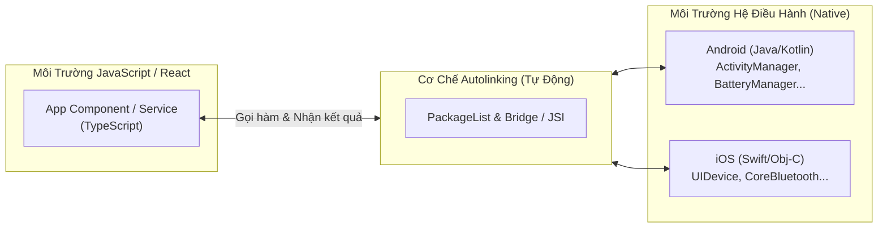

# XÂY DỰNG & TÁI SỬ DỤNG NATIVE MODULE TRONG REACT NATIVE
> **Dành cho:** Lập trình viên mới bắt đầu, đội ngũ phát triển React Native muốn chuẩn hóa kiến trúc thư viện dùng chung cho nhiều ứng dụng.  
> **Áp dụng cho:** Cả kiến trúc truyền thống (Bare React Native) lẫn hệ sinh thái Expo hiện đại (Prebuild / EAS).

---

## MỤC LỤC
1. [Bản Chất Kiến Trúc & Vì Sao Phải Tách Thư Viện Riêng](#1-bản-chất-kiến-trúc--vì-sao-phải-tách-thư-viện-riêng)
2. [Bước 1: Khởi Tạo Bộ Khung Thư Viện Bằng Tool Chuẩn](#2-bước-1-khởi-tạo-bộ-khung-thư-viện-bằng-tool-chuẩn)
3. [Bước 2: Viết Mã Nguồn Native Phía Android (Java)](#3-bước-2-viết-mã-nguồn-native-phía-android-java)
4. [Bước 3: Viết Tầng TypeScript Wrapper (Interface)](#4-bước-3-viết-tầng-typescript-wrapper-interface)
5. [Bước 4: Chạy Thử Nghiệm Ngay Trên App Mẫu (example)](#5-bước-4-chạy-thử-nghiệm-ngay-trên-app-mẫu-example)
6. [Bước 5: Phân Phối Thư Viện Để Tái Sử Dụng Cho Nhiều App](#6-bước-5-phân-phối-thư-viện-để-tái-sử-dụng-cho-nhiều-app)
7. [Bước 6: Cài Đặt Và Sử Dụng Trong Ứng Dụng Con](#7-bước-6-cài-đặt-và-sử-dụng-trong-ứng-dụng-con)
8. [Các Lỗi Kinh Điển Thường Gặp & Cách Khắc Phục](#8-các-lỗi-kinh-điển-thường-gặp--cách-khắc-phục)
9. [Các Giá Trị Cốt Lõi Khi Bảo Vệ Thiết Kế Với Lead](#9-các-giá-trị-cốt-lõi-khi-bảo-vệ-thiết-kế-với-lead)

---

## 1. BẢN CHẤT KIẾN TRÚC & VÌ SAO PHẢI TÁCH THƯ VIỆN RIÊNG

### 1.1. Native Module là gì?
Mã JavaScript (React Native) chạy trong một "hộp cát" (Sandbox của JS Engine như Hermes/V8), hoàn toàn không thể trực tiếp điều khiển phần cứng của điện thoại (RAM, Pin, Bluetooth, NFC, vân tay...). 

**Native Module** là cầu nối (Bridge / JSI) cho phép JavaScript gửi chỉ thị xuống mã nguồn gốc của hệ điều hành (Java/Kotlin trên Android, Swift/Obj-C trên iOS) và nhận kết quả trả về.



### 1.2. Tại sao phải tách thành Thư viện riêng (NPM Package)?
Nếu viết code Native trực tiếp vào thư mục `android/app/src/...` của app:
* **Rủi ro mất trắng code:** Khi chạy `npx expo prebuild --clean`, thư mục `android/` sẽ bị xóa sạch và tạo lại từ đầu.
* **Không thể tái sử dụng:** Công ty có 3 app (Khách hàng, Tài xế, Quản trị) thì phải copy-paste code Java sang 3 nơi, sửa bug phải sửa 3 lần.

**Giải pháp chuẩn hóa:** Đóng gói Native Module thành **Thư viện độc lập**:
* **An toàn tuyệt đối:** Nằm trong `node_modules`, dù có prebuild clean 1.000 lần thì hệ thống vẫn tự link lại.
* **Dùng chung không giới hạn:** Các app con chỉ cần chạy `pnpm add <tên-thư-viện>` là dùng được ngay.
* **Quản lý phiên bản (Versioning):** Nâng cấp tính năng độc lập bằng semantic versioning (`v1.0.0`, `v1.0.1`).

---

## 2. BƯỚC 1: KHỞI TẠO BỘ KHUNG THƯ VIỆN BẰNG TOOL CHUẨN

Cộng đồng React Native chính thức cung cấp công cụ `create-react-native-library` để tạo khung thư viện đầy đủ cả Android, iOS và TypeScript.

### 2.1. Lệnh khởi tạo
Mở Terminal ở thư mục bên ngoài các dự án app và chạy:

```bash
npx create-react-native-library@latest react-native-device-helper
```

### 2.2. Các câu hỏi cấu hình từng bước:
1. **What is the name of the package?** $\rightarrow$ `react-native-device-helper`
2. **What is the description?** $\rightarrow$ `Module đọc thông tin phần cứng Android & iOS dùng chung`
3. **What type of library do you want to develop?** $\rightarrow$ Chọn: **`Turbo module (Integration for native APIs to JS)`**
4. **Which language do you want to use for native code?** $\rightarrow$ Chọn: **`Kotlin & Objective-C`**
5. **What type of example app do you want to create?** $\rightarrow$ Chọn: **`App with Expo CLI (Managed Expo app for easier upgrades)`**
6. **Which tools do you want to configure?** $\rightarrow$ Chọn: **`ESLint with Prettier, Jest, Lefthook with Commitlint, Release It`**

---

### 2.3. Cấu trúc thư mục thực tế được tạo ra
```text
react-native-device-helper/
├── android/                             <-- Mã nguồn Android độc lập của thư viện
│   ├── build.gradle                     <-- Cấu hình biên dịch Gradle
│   └── src/main/java/com/devicehelper/
│       ├── DeviceHelperModule.java      <-- File logic Native chính (đọc RAM, Pin, Toast)
│       └── DeviceHelperPackage.java     <-- File đăng ký module vào React Native
├── ios/                                 <-- Mã nguồn iOS độc lập của thư viện
│   ├── DeviceHelper.podspec             <-- Cấu hình CocoaPods cho iOS
│   ├── DeviceHelper.h
│   └── DeviceHelper.mm
├── src/                                 <-- Tầng giao tiếp TypeScript
│   ├── NativeDeviceHelper.ts            <-- Spec interface của TurboModule
│   ├── index.tsx                        <-- File wrapper và export chính cho JS/TS
│   ├── multiply.native.tsx
│   └── multiply.tsx
├── example/                             <-- App mẫu Expo tích hợp sẵn để test ngay tại chỗ
│   ├── src/App.tsx                      <-- Giao diện test các nút bấm Native
│   └── package.json
├── package.json                         <-- Khai báo metadata thư viện
└── .yarnrc.yml                          <-- Cấu hình Yarn modern (Berry)
```

---

### 2.4. BƯỚC BẮT BUỘC: Cài đặt Dependencies cho Thư viện
> **Hiện tượng thường gặp:** Khi vừa tạo xong thư viện, nếu bạn mở file `src/index.tsx` trong VS Code ngay, bạn sẽ thấy báo lỗi đỏ gạch chân:  
> `Cannot find module "react-native" or its corresponding type declarations.`  
>  
> **Nguyên nhân:** Công cụ `create-react-native-library` chỉ sinh ra bộ khung file chứ **chưa tự động tải thư viện về máy** (chưa có thư mục `node_modules`).

**Cách xử lý (Chạy 1 lần duy nhất):**  
Mở terminal tại thư mục gốc của thư viện (`react-native-device-helper`) và chạy lệnh:

```bash
corepack yarn install
# hoặc nếu máy đã cài yarn global: yarn install
```
Sau khi cài đặt xong, nhấn tổ hợp phím `Ctrl + Shift + P` trên VS Code $\rightarrow$ gõ **`Developer: Reload Window`** $\rightarrow$.

---

## 3. BƯỚC 2: VIẾT MÃ NGUỒN NATIVE PHÍA ANDROID (JAVA)

> **LƯU Ý:**
> Sau khi bạn tạo 2 file `.java` bên dưới, **BẮT BUỘC PHẢI XÓA 2 FILE `.kt` MẶC ĐỊNH CÓ CÙNG TÊN** (`DeviceHelperModule.kt` và `DeviceHelperPackage.kt`).  
> Nếu không xóa, trình biên dịch Android sẽ báo lỗi: `Duplicate class com.devicehelper.DeviceHelperModule found in modules...` do có 2 file cùng định nghĩa 1 class!

### 3.1. File 1: `DeviceHelperModule.java`
Đường dẫn: `android/src/main/java/com/devicehelper/DeviceHelperModule.java`

> **Giải thích cho người mới:**
> * Kế thừa `ReactContextBaseJavaModule` để trở thành một Native Module hợp lệ.
> * `getName()`: Trả về tên định danh khi JS gọi `NativeModules.<TênModule>`.
> * `@ReactMethod`: Bắt buộc phải có để công khai hàm ra JavaScript.
> * `Promise promise`: Dùng để trả dữ liệu về cho JS bất đồng bộ (`promise.resolve()` khi thành công, `promise.reject()` khi lỗi).
> * `UiThreadUtil.runOnUiThread`: Đẩy code về Main Thread khi cần tương tác với UI hệ thống (như hiển thị Toast).

```java
package com.devicehelper;

import android.app.ActivityManager;
import android.content.Context;
import android.content.Intent;
import android.content.IntentFilter;
import android.os.BatteryManager;
import android.os.Build;
import android.widget.Toast;

import androidx.annotation.NonNull;

import com.facebook.react.bridge.Arguments;
import com.facebook.react.bridge.Promise;
import com.facebook.react.bridge.ReactApplicationContext;
import com.facebook.react.bridge.ReactContextBaseJavaModule;
import com.facebook.react.bridge.ReactMethod;
import com.facebook.react.bridge.UiThreadUtil;
import com.facebook.react.bridge.WritableMap;
import com.facebook.react.modules.core.DeviceEventManagerModule;

import java.util.HashMap;
import java.util.Map;

public class DeviceHelperModule extends ReactContextBaseJavaModule {

    private final ReactApplicationContext reactContext;

    public DeviceHelperModule(ReactApplicationContext reactContext) {
        super(reactContext);
        this.reactContext = reactContext;
    }

    @NonNull
    @Override
    public String getName() {
        return "DeviceHelperModule";
    }

    // 1. Cung cấp hằng số tĩnh đọc đồng bộ (Sync Constants)
    @Override
    public Map<String, Object> getConstants() {
        Map<String, Object> constants = new HashMap<>();
        constants.put("ANDROID_VERSION", Build.VERSION.RELEASE);
        constants.put("SDK_INT", Build.VERSION.SDK_INT);
        constants.put("MANUFACTURER", Build.MANUFACTURER);
        constants.put("MODEL", Build.MODEL);
        return constants;
    }

    // 2. Hàm Bất đồng bộ: Lấy RAM & Pin qua Promise
    @ReactMethod
    public void getHardwareInfo(Promise promise) {
        try {
            // Đọc RAM
            ActivityManager actManager = (ActivityManager) reactContext.getSystemService(Context.ACTIVITY_SERVICE);
            ActivityManager.MemoryInfo memInfo = new ActivityManager.MemoryInfo();
            if (actManager != null) {
                actManager.getMemoryInfo(memInfo);
            }
            double totalRamMb = memInfo.totalMem / (1024.0 * 1024.0);
            double availRamMb = memInfo.availMem / (1024.0 * 1024.0);

            // Đọc Mức Pin
            IntentFilter filter = new IntentFilter(Intent.ACTION_BATTERY_CHANGED);
            Intent batteryStatus = reactContext.registerReceiver(null, filter);
            int level = batteryStatus != null ? batteryStatus.getIntExtra(BatteryManager.EXTRA_LEVEL, -1) : -1;
            int scale = batteryStatus != null ? batteryStatus.getIntExtra(BatteryManager.EXTRA_SCALE, -1) : -1;
            int batteryPct = (level >= 0 && scale > 0) ? (level * 100) / scale : -1;

            int status = batteryStatus != null ? batteryStatus.getIntExtra(BatteryManager.EXTRA_STATUS, -1) : -1;
            boolean isCharging = status == BatteryManager.BATTERY_STATUS_CHARGING ||
                                 status == BatteryManager.BATTERY_STATUS_FULL;

            // Đóng gói WritableMap gửi về cho React Native
            WritableMap map = Arguments.createMap();
            map.putDouble("totalRamMb", Math.round(totalRamMb));
            map.putDouble("availRamMb", Math.round(availRamMb));
            map.putInt("batteryLevel", batteryPct);
            map.putBoolean("isCharging", isCharging);
            map.putString("manufacturer", Build.MANUFACTURER);
            map.putString("model", Build.MODEL);
            map.putString("androidVersion", Build.VERSION.RELEASE);

            promise.resolve(map);
        } catch (Exception e) {
            promise.reject("HARDWARE_ERROR", "Lỗi đọc phần cứng: " + e.getMessage(), e);
        }
    }

    // 3. Thực thi hành động Native: Bắn Android Toast
    @ReactMethod
    public void showToast(String message, int duration) {
        UiThreadUtil.runOnUiThread(new Runnable() {
            @Override
            public void run() {
                int toastDuration = (duration == 1) ? Toast.LENGTH_LONG : Toast.LENGTH_SHORT;
                Toast.makeText(reactContext, message, toastDuration).show();
            }
        });
    }

    // 4. Bắn sự kiện ngược từ Native lên JS (Event Emitter)
    @ReactMethod
    public void triggerNativePing(String customNote) {
        WritableMap eventData = Arguments.createMap();
        eventData.putString("message", "Ping từ Android: " + customNote);
        eventData.putDouble("timestamp", (double) System.currentTimeMillis());

        reactContext
            .getJSModule(DeviceEventManagerModule.RCTDeviceEventEmitter.class)
            .emit("onDeviceHelperPing", eventData);
    }

    // Bắt buộc cho NativeEventEmitter
    @ReactMethod
    public void addListener(String eventName) {}

    @ReactMethod
    public void removeListeners(Integer count) {}
}
```

---

### 3.2. File 2: `DeviceHelperPackage.java`
Đường dẫn: `android/src/main/java/com/devicehelper/DeviceHelperPackage.java`

```java
package com.devicehelper;

import androidx.annotation.NonNull;

import com.facebook.react.ReactPackage;
import com.facebook.react.bridge.NativeModule;
import com.facebook.react.bridge.ReactApplicationContext;
import com.facebook.react.uimanager.ViewManager;

import java.util.ArrayList;
import java.util.Collections;
import java.util.List;

public class DeviceHelperPackage implements ReactPackage {

    @NonNull
    @Override
    public List<NativeModule> createNativeModules(@NonNull ReactApplicationContext reactContext) {
        List<NativeModule> modules = new ArrayList<>();
        modules.add(new DeviceHelperModule(reactContext));
        return modules;
    }

    @NonNull
    @Override
    public List<ViewManager> createViewManagers(@NonNull ReactApplicationContext reactContext) {
        return Collections.emptyList();
    }
}
```

---

## 4. BƯỚC 3: VIẾT TẦNG TYPESCRIPT WRAPPER (`src/index.tsx`)

Đường dẫn: `src/index.tsx` *(chú ý: nằm trực tiếp trong thư mục `src/`, không nhầm sang thư mục `android/`)*.

```typescript
import { NativeModules, NativeEventEmitter, Platform } from 'react-native';

export { multiply } from './multiply';

const LINKING_ERROR =
  `Thư viện 'react-native-device-helper' chưa được liên kết!\n\n` +
  Platform.select({ ios: "- Bạn đã chạy 'pod install' chưa?\n", default: '' }) +
  '- Hãy kiểm tra lại xem app đã build lại mã Native chưa.\n';

const DeviceHelperModule = NativeModules.DeviceHelperModule
  ? NativeModules.DeviceHelperModule
  : new Proxy(
      {},
      {
        get() {
          throw new Error(LINKING_ERROR);
        },
      }
    );

export interface HardwareInfo {
  totalRamMb: number;
  availRamMb: number;
  batteryLevel: number;
  isCharging: boolean;
  manufacturer: string;
  model: string;
  androidVersion: string;
}

export interface DeviceConstants {
  ANDROID_VERSION: string;
  SDK_INT: number;
  MANUFACTURER: string;
  MODEL: string;
}

// 1. Đọc Constants tĩnh
export const getDeviceConstants = (): DeviceConstants | null => {
  if (Platform.OS !== 'android') return null;
  return {
    ANDROID_VERSION: DeviceHelperModule.ANDROID_VERSION,
    SDK_INT: DeviceHelperModule.SDK_INT,
    MANUFACTURER: DeviceHelperModule.MANUFACTURER,
    MODEL: DeviceHelperModule.MODEL,
  };
};

// 2. Lấy thông tin phần cứng qua Promise
export const getHardwareInfo = async (): Promise<HardwareInfo> => {
  return await DeviceHelperModule.getHardwareInfo();
};

// 3. Hiển thị Android Toast
export const showToast = (message: string, isLong = false): void => {
  if (Platform.OS === 'android') {
    DeviceHelperModule.showToast(message, isLong ? 1 : 0);
  }
};

// 4. Kích hoạt Event từ Native
export const triggerNativePing = (note: string): void => {
  DeviceHelperModule.triggerNativePing(note);
};

// 5. Đăng ký nhận Event (đã fix type TS2345)
let eventEmitter: NativeEventEmitter | null = null;
if (DeviceHelperModule) {
  eventEmitter = new NativeEventEmitter(DeviceHelperModule);
}

export const subscribeToDevicePing = (
  callback: (event: { message: string; timestamp: number }) => void
): (() => void) => {
  if (!eventEmitter) return () => {};
  const subscription = eventEmitter.addListener(
    'onDeviceHelperPing',
    (event: any) => callback(event)
  );
  return () => {
    subscription.remove(); // Dọn dẹp listener tránh rò rỉ RAM
  };
};
```

> **Kiểm tra độ chuẩn xác:** Chạy lệnh `corepack yarn typecheck`. Kết quả báo **0 errors** là code TypeScript đã hoàn toàn hợp lệ!

---

## 5. BƯỚC 4: CHẠY THỬ NGHIỆM NGAY TRÊN APP MẪU (`example/`)

Trước khi đem thư viện đi tích hợp vào các app khác, có thể chạy thử trực tiếp trên app mẫu Expo đi kèm sẵn trong thư viện.

Mở terminal tại thư mục `react-native-device-helper` và gõ:

```bash
corepack yarn example android
```

Hệ thống sẽ tự động khởi động máy ảo hoặc thiết bị thật Android, cài app mẫu và hiển thị giao diện để bạn bấm nút đọc RAM, Pin và bắn Toast ngay tại chỗ!

---

## 6. BƯỚC 5: PHÂN PHỐI THƯ VIỆN ĐỂ TÁI SỬ DỤNG CHO NHIỀU APP

Bạn chọn 1 trong 3 phương án tùy thuộc hạ tầng của công ty:

### Phương án A: Lưu trên Git nội bộ của công ty (Nhanh nhất & Miễn phí 100%)
1. Khởi tạo Git bên trong thư mục thư viện:
   ```bash
   git init
   git add .
   git commit -m "feat: initial native device helper library"
   ```
2. Đẩy lên GitLab hoặc GitHub riêng của công ty:
   ```bash
   git remote add origin https://gitlab.mycompany.com/mobile-libs/react-native-device-helper.git
   git push -u origin main
   ```

### Phương án B: Dùng Monorepo (pnpm workspaces / Turborepo)
Nếu tất cả các app và thư viện cùng nằm trong 1 repo lớn, bạn chỉ cần đưa thư viện vào thư mục `packages/react-native-device-helper`.

### Phương án C: Publish lên Private NPM Registry
Nếu công ty có hệ thống quản lý gói riêng (Verdaccio / Nexus / GitHub Packages):
```bash
npm publish --access restricted
```

---

## 7. BƯỚC 6: CÀI ĐẶT VÀ SỬ DỤNG TRONG ỨNG DỤNG CON (`rn`, `rn-demo`, `rn-base`)

### 7.1. Cài đặt vào bất kỳ App nào trong công ty
Tại thư mục gốc của App con cần dùng:

* **Nếu dùng Git (Phương án A):**
  ```bash
  pnpm add git+https://gitlab.mycompany.com/mobile-libs/react-native-device-helper.git
  ```
* **Nếu dùng Monorepo (Phương án B):**
  ```bash
  pnpm add react-native-device-helper --workspace
  ```
* **Nếu dùng Private NPM (Phương án C):**
  ```bash
  pnpm add @company/react-native-device-helper
  ```

> 🎯 **LƯU Ý CỰC KỲ QUAN TRỌNG:**
> Bạn **KHÔNG CẦN** sửa bất kỳ dòng code nào trong `MainApplication.kt` hay `android/` của App con! Cơ chế **Autolinking** của React Native sẽ tự động tìm thấy và liên kết thư viện vào app!  
> **Dù bạn có chạy `npx expo prebuild --clean` bao nhiêu lần thì code Native trong thư viện vẫn an toàn 100%!**

---

### 7.2. Gọi và sử dụng trong màn hình UI của App con

Mở bất kỳ màn hình nào trong app con (ví dụ: `HomeScreen.tsx`):

```tsx
import React, { useState, useEffect } from 'react';
import { View, Text, Button, StyleSheet } from 'react-native';
import {
  getHardwareInfo,
  showToast,
  subscribeToDevicePing,
  triggerNativePing,
  type HardwareInfo,
} from 'react-native-device-helper';

export function HardwareDemoScreen() {
  const [info, setInfo] = useState<HardwareInfo | null>(null);
  const [eventMsg, setEventMsg] = useState<string>('');

  useEffect(() => {
    // Đăng ký nhận sự kiện
    const unsubscribe = subscribeToDevicePing((event) => {
      setEventMsg(`${event.message} lúc ${new Date(event.timestamp).toLocaleTimeString()}`);
    });

    // Cleanup khi component bị hủy
    return () => unsubscribe();
  }, []);

  const handleReadHardware = async () => {
    try {
      const data = await getHardwareInfo();
      setInfo(data);
    } catch (error: any) {
      alert(error.message);
    }
  };

  return (
    <View style={styles.container}>
      <Text style={styles.title}>Demo Gọi Thư Viện Native Dùng Chung</Text>

      <Button title="1. Đọc RAM & Pin từ Native" onPress={handleReadHardware} />
      {info && (
        <View style={styles.box}>
          <Text>RAM trống: {info.availRamMb} MB / {info.totalRamMb} MB</Text>
          <Text>Pin: {info.batteryLevel}% (Đang sạc: {info.isCharging ? 'Có' : 'Không'})</Text>
        </View>
      )}

      <View style={{ height: 15 }} />
      <Button
        title="2. Bắn Android Toast"
        onPress={() => showToast('Xin chào từ Thư Viện Dùng Chung!')}
      />

      <View style={{ height: 15 }} />
      <Button
        title="3. Bắn Event Native -> JS"
        onPress={() => triggerNativePing('Test Ping!')}
      />
      {eventMsg !== '' && <Text style={styles.eventText}>{eventMsg}</Text>}
    </View>
  );
}

const styles = StyleSheet.create({
  container: { flex: 1, padding: 20, justifyContent: 'center' },
  title: { fontSize: 18, fontWeight: 'bold', marginBottom: 20, textAlign: 'center' },
  box: { backgroundColor: '#f0f0f0', padding: 10, marginTop: 10, borderRadius: 8 },
  eventText: { marginTop: 10, color: 'green', textAlign: 'center' },
});
```

---

## 8. CÁC LỖI KINH ĐIỂN THƯỜNG GẶP & CÁCH KHẮC PHỤC

### Lỗi 1: `Cannot find module "react-native" or its corresponding type declarations`
* **Nguyên nhân:** Thư viện vừa khởi tạo chưa có thư mục `node_modules`.
* **Khắc phục:** Chạy `corepack yarn install` bên trong thư mục thư viện, sau đó reload lại cửa sổ VS Code (`Ctrl + Shift + P` $\rightarrow$ `Developer: Reload Window`).

### Lỗi 2: `Duplicate class com.devicehelper.DeviceHelperModule found in modules...`
* **Nguyên nhân:** Khi thêm file `.java`, bạn chưa xóa file `.kt` mặc định có cùng tên trong thư mục `android/src/main/java/...`.
* **Khắc phục:** Xóa bỏ 2 file `.kt` mặc định (`DeviceHelperModule.kt` và `DeviceHelperPackage.kt`).

### Lỗi 3: `Argument of type '(event: ...) => void' is not assignable to parameter... (TS2345)`
* **Nguyên nhân:** Kiểu dữ liệu sự kiện của `NativeEventEmitter.addListener` trong React Native yêu cầu callback nhận `(...args: any[]) => void`.
* **Khắc phục:** Bọc hàm callback dưới dạng: `(event: any) => callback(event)`.

### Lỗi 4: `CalledFromWrongThreadException: Only the original thread that created a view hierarchy can touch its views`
* **Nguyên nhân:** Hàm `@ReactMethod` can thiệp vào giao diện của Android (như hiển thị Toast, Dialog) nhưng lại chạy trên Background Thread của React Native.
* **Khắc phục:** Luôn bọc code can thiệp UI trong `UiThreadUtil.runOnUiThread(...)`.

---

## 9. CÁC GIÁ TRỊ CỐT LÕI KHI BẢO VỆ THIẾT KẾ VỚI LEAD

1. **Tính bền vững trước lệnh Prebuild của Expo:**  
   > *"Thư viện được quản lý trong `node_modules`, mỗi khi team chạy `npx expo prebuild --clean` để nâng cấp bản Expo/RN mới, cơ chế Autolinking sẽ tự động nhận diện lại mà không sợ mất bất kỳ dòng code native nào."*

2. **Tiết kiệm tối đa chi phí bảo trì (Single Source of Truth):**  
   > *"Tất cả các tính năng can thiệp phần cứng hay SDK bên thứ 3 chỉ cần viết và bảo trì ở 1 repository duy nhất. Các ứng dụng khác trong công ty chỉ việc cập nhật version package là có ngay tính năng mới."*

3. **Phân tách trách nhiệm chuyên nghiệp (Separation of Concerns):**  
   > *"Dev làm giao diện React Native không cần biết Java hay Swift, chỉ cần gọi hàm qua TypeScript Interface với autocomplete đầy đủ."*
